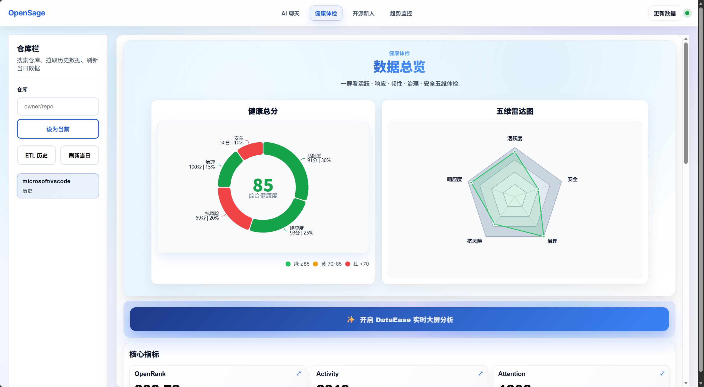
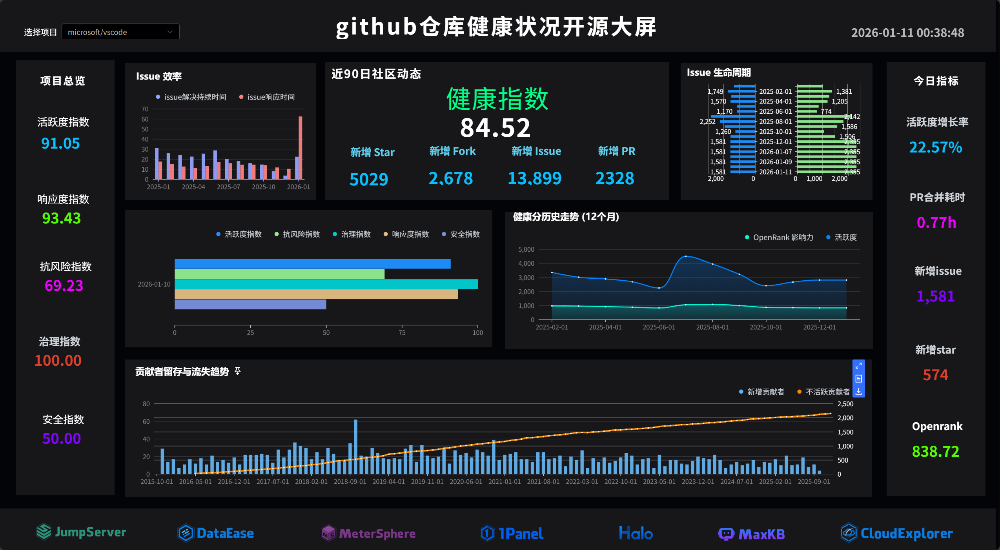
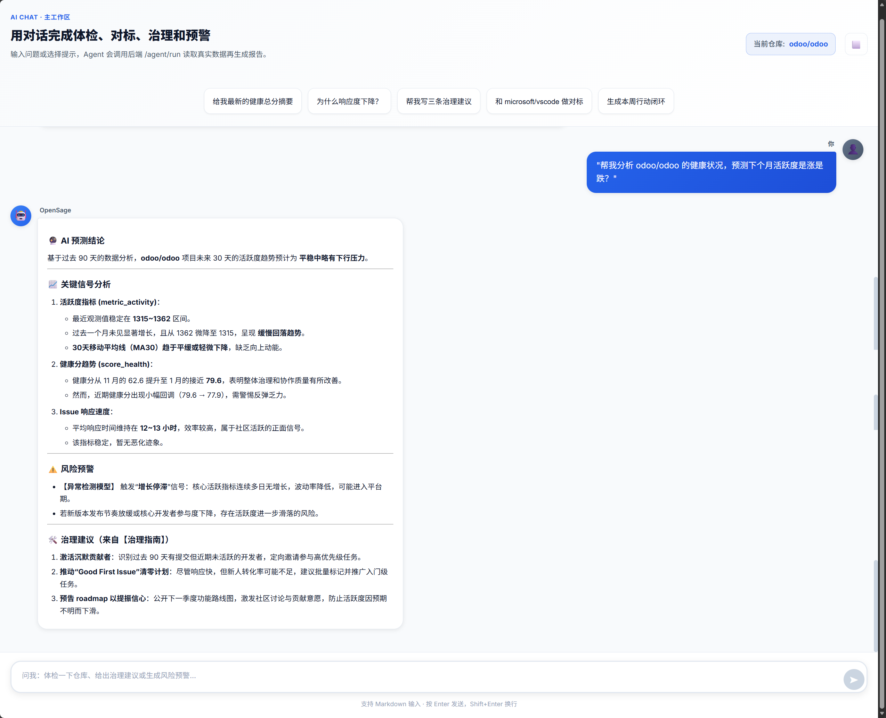
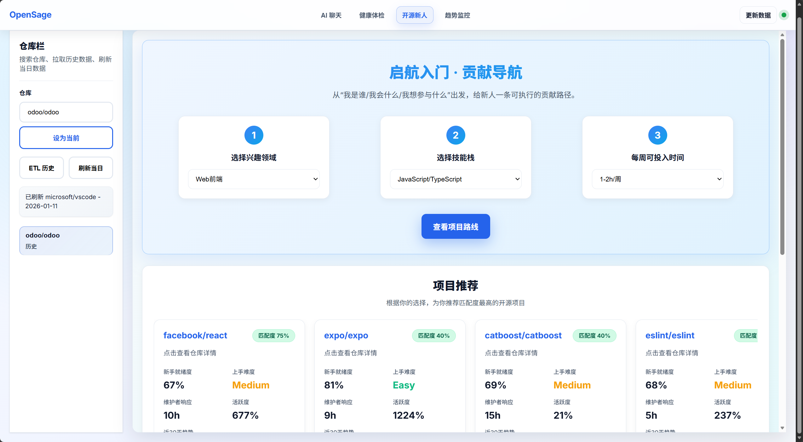
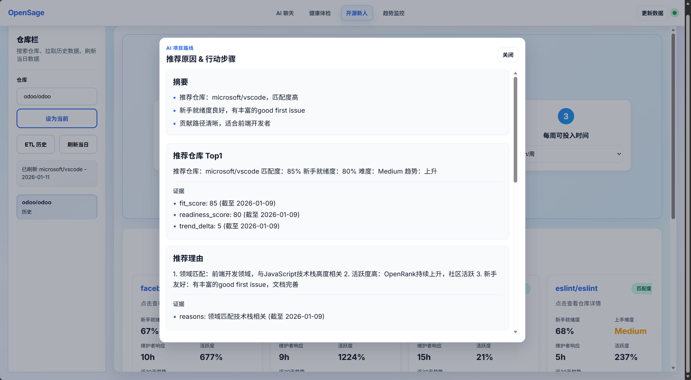
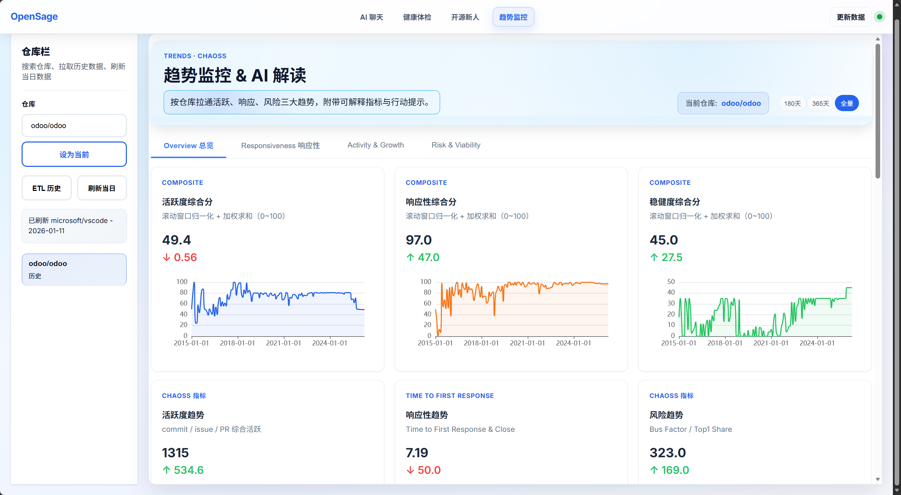
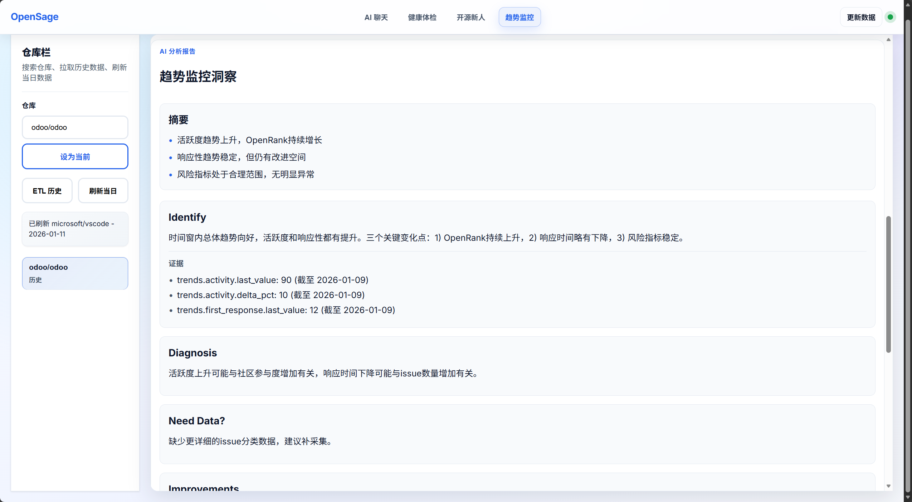

[](https://www.python.org/)
[](LICENSE)

# OpenSage

## 目录

- [简介](#简介)
- [核心特性](#核心特性)
- [技术架构](#技术架构)
- [安装部署](#安装部署)
- [快速体验](#快速体验)
- [项目结构](#项目结构)
- [项目运行效果图](#项目运行效果图)
- [许可证](#许可证)

---

## 简介

OpenSage AI 是一个面向开源生态的 **一站式 AI Agent 综合体**。它将分散在 OpenDigger、GitHub、OpenSSF Scorecard 等多平台的孤立数据整合到同一条智能流水线中：用户只需自然语言提问，系统即可自动完成 **取数 → 清洗算分 → 分析洞察 → 生成报告 → 持续监控** 的全链路治理。

相比传统的数据看板，OpenSage 不仅提供数据，更强调“治理闭环”：从**Evidence**（数据证据）到**Prescription**（治理处方）再到**Track**（闭环追踪）。让开源治理从“凭感觉”走向“可量化、可执行”。

---

## 项目核心功能

### 1. 🩺 多维健康体检与 DataEase 可视化

基于独创的 **五维健康评分模型**，为项目提供全方位的“CT 扫描”。数据不仅以 JSON 形式返回，还直接对接 **DataEase** 大屏，生成可交互的健康度看板。

**五维评分模型权重与核心算法：**

$$ \text{HealthScore} = 0.30 V + 0.25 R + 0.20 Re + 0.15 G + 0.10 S $$

- **Vitality (活跃度 30%)**:  
  综合 OpenRank 影响力、Activity 活跃量（对数评分）、社区参与人数与增长率。
  $$ \text{Score}\_V = \ln(1 + \text{OpenRank}) \times w_1 + \dots $$
- **Responsiveness (响应度 25%)**:  
  基于 **时间衰减函数** $T(h)$ 评估 Issue/PR 的首响时间、关闭周期与积压率。
  $$ T(h) = \max(0, 100 \times \frac{\text{bad} - h}{\text{bad} - \text{good}}) $$
- **Resilience (韧性 20%)**:  
  结合 Bus Factor（总线因子）、贡献者多样性 (HHI 指数) 与留存率，评估项目抗风险能力。
- **Governance (治理 15%)**:  
  检查 README/LICENSE/Contributing 等文档完整度及社区流程透明度。
- **Security (安全 10%)**:  
  集成 OpenSSF Scorecard 标准，评估项目安全水位。

[📚 查看完整健康分算法文档](knowledge_base/Health_Score_Algorithm.md)

### 健康体检数据总览效果图



### Dataease 数据大屏效果图



### 2. 🤖 OpenSage 智能对话与实时洞察

无需学习复杂的 SQL 或指标定义，直接像咨询专家一样提问。Agent 引擎会自动理解意图、调度工具链、生成图文并茂的分析报告。

- **多模态输出**：结论 + 证据卡 (Evidence Card) + 趋势图 + 治理建议。
- **ReAct 闭环**：Reason(意图拆解) → Act(工具调度) → Observe(数据校验) → Reflect(生成处方)。
- **典型场景**：
  > "对比 Vue 和 React 最近三个月的活跃度趋势"
  > "帮我分析一下 pytorch 目前存在的安全风险"

### OpenSage 对话示例效果图



### 3. 🌱 开源新人个性化导航 (Onboarding)

专为开源新手设计的推荐引擎，解决“想贡献但不知道选哪个项目、做什么任务”的痛点。

- **算法驱动推荐**：
  基于用户的 **技术栈**、**时间投入** 与 **兴趣领域**，结合项目的 **Readiness Score**（新人准备度），计算最佳匹配度。
  $$ \text{Match} = 0.55 \times \text{Fit} + 0.45 \times \text{Readiness} $$
- **可执行任务清单**：
  自动挖掘项目中的 `good_first_issue` 或 `help_wanted` 任务，并生成定制化的 **Onboarding Checklist**（环境搭建、文档阅读、测试运行），帮助新人将 Ready-to-Code 时间缩短至周级别。

[📚 查看完整推荐算法文档](knowledge_base/Recommendation_Algorithm.md)

### 开源新人项目个性化推荐板块效果图




### 4. 📈 趋势分析与风险预警

不只看现状，更看未来。系统对历史时序数据进行统计分析，识别演变方向并预警潜在风险。

- **趋势判定算法**：
  使用 **最小二乘法 (Least Squares)** 线性回归计算关键指标（如 OpenRank、响应时间）的斜率 $k$，判定 Rising/Falling 趋势。
  $$ k = \frac{N \sum xy - \sum x \sum y}{N \sum x^2 - (\sum x)^2} $$
- **异常检测**：
  基于 **Z-Score** 识别数据突变，结合业务阈值（如 "PR 首响 > 48h"、"Top1 份额 > 50%"）自动触发风险提示。
- **可视化报告**：
  生成包含趋势解读、异常点诊断和改进建议的综合治理报告。

[📚 查看完整趋势分析算法文档](knowledge_base/Trend_Analysis_Algorithm.md)

### 趋势监控及 Agent 分析板块效果图




---

## 技术架构

OpenSage 采用 **四层智能架构设计**，实现从自然语言输入到治理闭环的端到端流转。

### 1. 用户交互层

- **Frontend**: Vite + React 提供流畅的聊天界面与 Web 可视化。
- **Interaction**: 支持自然语言多轮对话与 DataEase 内嵌大屏展示。

### 2. AI Agent 引擎层

- **Orchestrator**: 基于 BERT + LLM 的意图理解与任务编排。
- **MetricEngine**: 核心算分引擎，负责数据清洗、归一化与五维健康分计算。
- **Planner**: 智能路由调度，根据任务类型选择最短工具路径（实时查询 vs 预计算）。
- **OnboardingEngine**: 面向开源新人，计算 `Match = 0.55×Fit + 0.45×Readiness`，生成个性化推荐与任务清单（good_first_issue / help_wanted）。
- **TrendMonitor**: 针对 OpenRank/活跃度/响应时间等关键时序指标执行趋势判定（最小二乘斜率 k）与异常检测（Z-Score），输出风险预警与阈值建议。

### 3. 工具与数据层

- **Tools Integrations**:
  - **OpenDigger**: 核心指标数据源。
  - **GitHub API**: 社区治理档案与实时 Issue 状态。
  - **OpenSSF Scorecard**: 安全评分数据。
  - **DataEase**: BI 可视化大屏渲染。
  - **MaxKB**: 知识库/知识增强（策略库、解释库、SOP 模板）。
- **Storage Strategy (四级缓存)**:
  - **Memory/Redis**: 热点查询秒级响应。
  - **IoTDB**: 海量历史时序数据存储，支持趋势分析。
  - **PostgreSQL**: 业务数据、快照与冷数据归档。

### 4. 输出层

- 图文报告：生成结构化的分析报告与治理结论，支持 Markdown/HTML 输出。
- 可视化图表：趋势、对标、雷达等图表，可嵌入 Web 或 DataEase 大屏。
- 可执行建议：结合 Evidence Card 输出治理“处方”，含任务清单与阈值建议。
- 实时预警：监控关键指标变化，触发告警并用于追踪闭环。

---

## 安装部署

### 环境要求

- Windows 10/11（建议）
- Docker Desktop（用于 PostgreSQL）
- Python 3.10+（后端）
- Node.js 18+ 与 npm（前端 ui-react）

### 1) 启动数据库

```bash
docker compose -f docker-compose.db.yml up -d
```

### 2) 启动后端（FastAPI）

```bash
cd backend
python -m venv .venv
.venv\Scripts\activate
python -m pip install -U pip setuptools wheel
pip install -r requirements.txt
python -m uvicorn app.main:app --reload --host 0.0.0.0 --port 8000
```

可选（存在时）：

```bash
backend\run_dev.bat
```

### 3) 启动前端（ui-react）

```bash
cd ui-react
npm install
npm run dev
```

前端预览：http://127.0.0.1:5173/

### 4) 一键容器（可选）

```bash
docker compose up -d
```

停止并清理：

```bash
docker compose down
```

---

## 快速体验

- 健康检查：GET http://127.0.0.1:8000/health
- 指标/预测/告警/组合：见 backend/app/api 下的路由（metrics.py、forecast.py、monitor.py、portfolio.py）。
- 图分析（可选）：backend/app/api/graph.py。

---

## 项目结构

```text
OpenSODA-OSS-Copilot/
├── backend/                  # FastAPI + Agent 编排 + ETL + 监控
│   ├── app/
│   │   ├── main.py           # FastAPI 入口
│   │   ├── api/              # health/metrics/forecast/monitor/portfolio/graph
│   │   ├── core/             # 配置与日志
│   │   ├── db/               # SQLAlchemy、模型与迁移
│   │   ├── jobs/             # APScheduler 定时任务
│   │   ├── tools/            # OpenDigger/DataEase/EasyGraph/LLM 适配
│   │   └── tests/            # 回归测试
│   ├── requirements.txt
│   ├── Dockerfile
│   └── run_dev.bat           # Windows 本地开发脚本（可选）
├── ui-react/                 # React + Vite 前端
│   ├── src/
│   ├── package.json
│   └── vite.config.js
├── frontend/                 # 另一个轻量前端（可选）
├── dashboards/               # DataEase 数据集 SQL 与 README
├── graph_lab/                # 图分析实验区（可选加分项）
├── scripts/                  # 数据种子与 ETL 脚本
├── data/                     # demo 组合、种子与缓存
├── docker-compose.db.yml     # 仅数据库
├── docker-compose.yml        # 后端 + DB + Redis（可选）
├── Makefile                  # make up/demo/down（可选）
└── README.md
```

---

## 许可证

本项目采用 MIT 许可证，详见 LICENSE。
